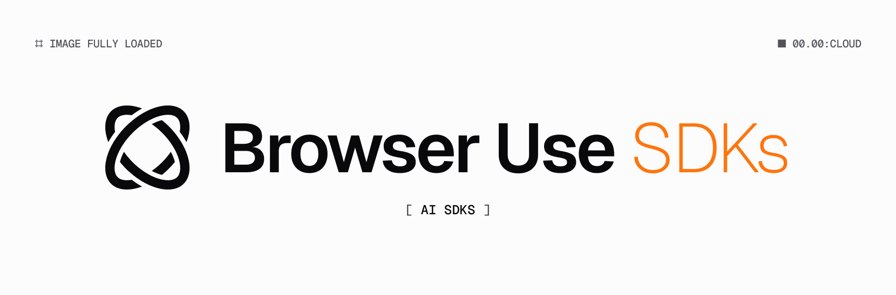

<p align="center">
  
</p>

# Browser Use SDKs

Official SDKs for the [Browser Use](https://browser-use.com) cloud API.

## Packages

| Package | Language | Registry | Version |
|---------|----------|----------|---------|
| [browser-use-sdk](browser-use-node/) | TypeScript | npm | 3.0.0 |
| [browser-use-sdk](browser-use-python/) | Python | PyPI | 3.0.0 |

Both packages support **v2** (default, stable) and **v3** (experimental, via subpath import).

## Quick Start

### TypeScript

```bash
npm install browser-use-sdk
```

```typescript
import { BrowserUse } from "browser-use-sdk";

const client = new BrowserUse({ apiKey: "bu_..." });
const result = await client.run({ task: "Go to google.com" }).complete();
```

### Python

```bash
pip install browser-use-sdk
```

```python
from browser_use_sdk import BrowserUse

client = BrowserUse(api_key="bu_...")
result = client.run("Go to google.com").complete()
```

## V3 (Experimental)

```typescript
import { BrowserUse } from "browser-use-sdk/v3";
```

```python
from browser_use_sdk.v3 import BrowserUse
```

## Development

Requires [Task](https://taskfile.dev) runner.

```bash
task gen:types   # regenerate types from OpenAPI specs
task build       # build both SDKs
task check       # type-check both SDKs
task test        # run tests
```

See [RUNBOOK.md](RUNBOOK.md) for the full update workflow.
