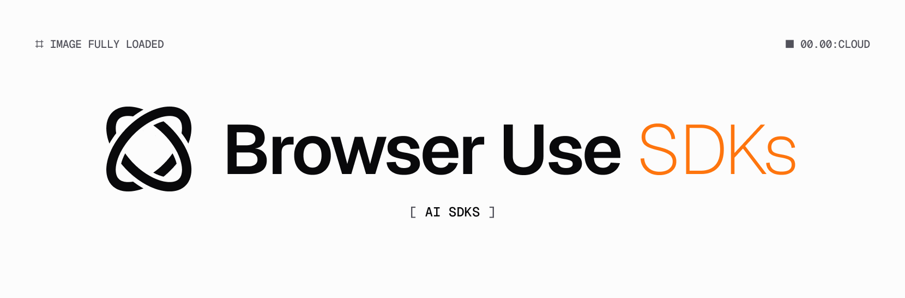

  

# Browser Use SDKs

Official SDKs for [Browser Use Cloud](https://browser-use.com).

- **Browser Use Agents:** use the V4 interface to give an agent a task
  and receive its completed result.
- **Browser Infrastructure:** hosted cloud browser infrastructure for AI agents,
  controlled through the V3 SDK browser resource, the V4 REST API, or CDP.

| Package | Language | Registry |
|---------|----------|----------|
| [browser-use-sdk](browser-use-python/) | Python | PyPI |
| [browser-use-sdk](browser-use-node/) | TypeScript | npm |

Start with the [Cloud quickstart](https://docs.browser-use.com/cloud/quickstart).
See the [developer overview](https://browser-use.com/developers) when choosing
an interface for a new integration.

## Docs

[docs.browser-use.com](https://docs.browser-use.com)
