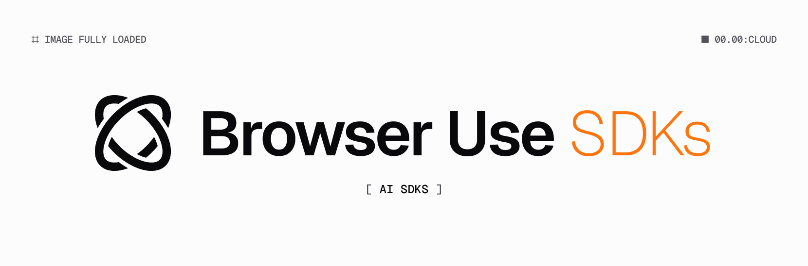

  

# Browser Use SDKs

Official SDKs for [Browser Use Cloud](https://browser-use.com).

**Browser tasks for a fraction of a cent.** BU Ultrafast recorded **$0.00214 median per URL check**, with **8/8 correct** in a small staging test. LLM + browser included; browsers stopped after each run. Actual cost varies; network traffic is billed separately. [Methodology](https://browser-use.com/pricing#task-cost-methodology).

BU Ultrafast and BU Fast are API V4 modes in early access, enabled per project. [Request access](https://browser-use.com/ultrafast) · [Token rates and REST examples](https://docs.browser-use.com/cloud/agent/models). Use REST if your installed SDK's model types do not yet include the aliases.

- **Browser Use Agents:** use the explicit V4 interface to give an agent a task
  and receive its completed result.
- **Browser Infrastructure:** use the explicit V4 SDK browser resource, or the
  V4 REST API, to create and control a managed browser.

| Package | Language | Registry |
|---------|----------|----------|
| [browser-use-sdk](browser-use-python/) | Python | PyPI |
| [browser-use-sdk](browser-use-node/) | TypeScript | npm |

Start with the [Cloud quickstart](https://docs.browser-use.com/cloud/quickstart).

## Docs

[docs.browser-use.com](https://docs.browser-use.com)
