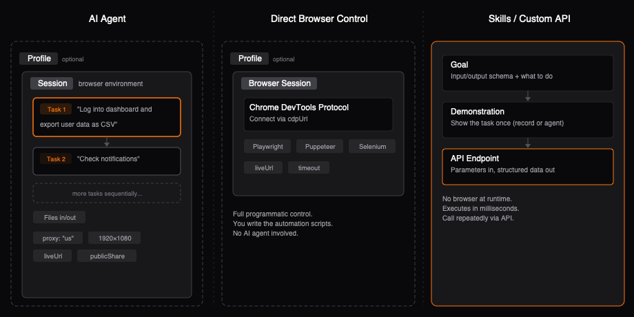

Browser Use Cloud gives you four approaches: **AI Agent Tasks**, **Direct Browser Control**, **Skills**, and the **Open Source Library** with cloud browsers.

<Frame></Frame>

## When to use what

| Use case | Approach | Best for |
|----------|----------|----------|
| "Do this for me" | **AI Agent Tasks** | Most users. Natural language in, structured data out. |
| Repeated extraction, production API | **Skills** | High-volume, deterministic. $0.02/call. |
| Custom Playwright/Puppeteer scripts | **Browser Infrastructure** | Developers who want raw CDP access with stealth infra. |
| Already using the open-source library | **Open Source + Cloud** | Keep your agent code, swap in cloud browsers. |

<Callout intent="tip">
  Start with **Tasks** — it's the fastest path to value. Move to **Skills** when you need a repeatable, production-grade endpoint.
</Callout>

## AI Agent Tasks

Give natural language instructions — the AI operates the browser for you.

<CodeBlocks>
  <CodeBlock title="Python">
    ```python
    from browser_use_sdk import AsyncBrowserUse

    client = AsyncBrowserUse()
    result = await client.run("Search for top 10 Hacker News posts")
    print(result.output)
    ```
  </CodeBlock>
  <CodeBlock title="TypeScript">
    ```typescript
    import { BrowserUse } from "browser-use-sdk";

    const client = new BrowserUse();
    const result = await client.run("Search for top 10 Hacker News posts");
    console.log(result.output);
    ```
  </CodeBlock>
</CodeBlocks>

## Direct Browser Control

Full programmatic access via Chrome DevTools Protocol. Write your own automation with Playwright, Puppeteer, or Selenium.

<CodeBlocks>
  <CodeBlock title="Python">
    ```python
    from browser_use_sdk import AsyncBrowserUse

    client = AsyncBrowserUse()
    browser = await client.browsers.create(proxy_country_code="us")
    # Connect via browser.cdp_url with Playwright/Puppeteer/Selenium
    ```
  </CodeBlock>
  <CodeBlock title="TypeScript">
    ```typescript
    import { BrowserUse } from "browser-use-sdk";

    const client = new BrowserUse();
    const browser = await client.browsers.create({ proxyCountryCode: "us" });
    // Connect via browser.cdpUrl with Playwright/Puppeteer/Selenium
    ```
  </CodeBlock>
</CodeBlocks>

## Skills

Describe what you need in plain text — get a production-ready API endpoint you can call repeatedly.

<CodeBlocks>
  <CodeBlock title="Python">
    ```python
    from browser_use_sdk import AsyncBrowserUse

    client = AsyncBrowserUse()
    result = await client.skills.execute(skill_id, parameters={"X": 10})
    print(result)
    ```
  </CodeBlock>
  <CodeBlock title="TypeScript">
    ```typescript
    import { BrowserUse } from "browser-use-sdk";

    const client = new BrowserUse();
    const result = await client.skills.execute(skillId, { parameters: { X: 10 } });
    console.log(result);
    ```
  </CodeBlock>
</CodeBlocks>

## Open Source Library

Already using the [open-source browser-use](https://github.com/browser-use/browser-use) Python library? Point it at cloud browsers with one flag — get stealth infra, proxies, and CAPTCHA solving without changing your agent code.

```python
from browser_use import Agent, Browser
from langchain_openai import ChatOpenAI

# Just set use_cloud=True — everything else stays the same
browser = Browser(use_cloud=True)

agent = Agent(
    task="Find the top 3 trending repos on GitHub",
    llm=ChatOpenAI(model="gpt-4o"),
    browser=browser,
)
result = await agent.run()
```

```bash
export BROWSER_USE_API_KEY=your_key
```

You can also pass `cloud_proxy_country_code` and `cloud_profile_id` for geo-routing and persistent login state. See the [open-source docs](https://docs.browser-use.com/customize/browser/remote) for full options.

## Core concepts

- **Task** — a natural language prompt the AI agent executes. The main thing you'll use.
- **Session** — a stateful browser environment. Auto-created by default, or create one manually for multi-step workflows.
- **Profile** — persistent browser state (cookies, localStorage). Login once, reuse across sessions.
- **Skill** — a website interaction turned into a deterministic API endpoint. Create once, call forever.

<Cards>
  <Card title="Tasks" icon="fa-solid fa-play" href="/guides/tasks">
    Structured output, streaming, and parameters.
  </Card>
  <Card title="Skills" icon="fa-solid fa-wand-magic-sparkles" href="/guides/skills">
    Turn websites into reliable APIs.
  </Card>
  <Card title="Browser Infrastructure" icon="fa-solid fa-globe" href="/guides/browser-api">
    Direct CDP access with stealth browsers.
  </Card>
</Cards>
